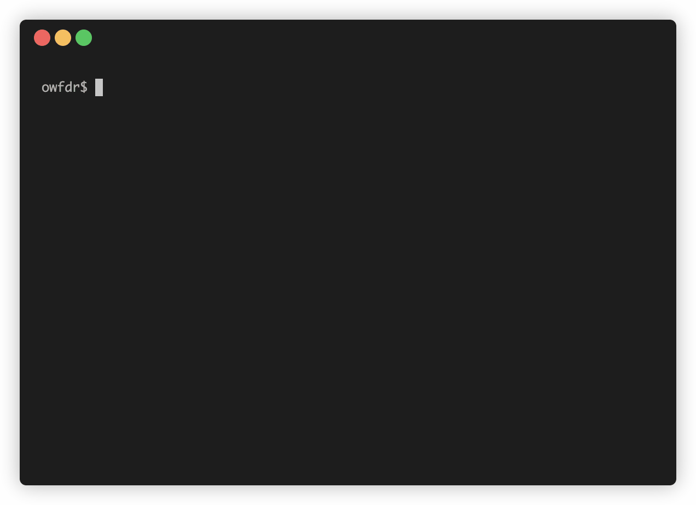

# Pepl

Automatically rerun Python script when it changes.



## Install

NPM

```bash
npm install --global pepl
```

Yarn

```bash
yarn global add pepl
```

## Usage

```bash
pepl [filename.py] [args...]
```

> Note: Pepl will enter interpreter mode if a filename isn't specified.

## 🧑‍💻 Other Apps

Check out:

- [Our World](https://ourworld.center/apps) (Official Website)
